# Module 2

## 1 Basic Commands

In this part we use `mkdir`, `cd` and `touch` to create the file structure.

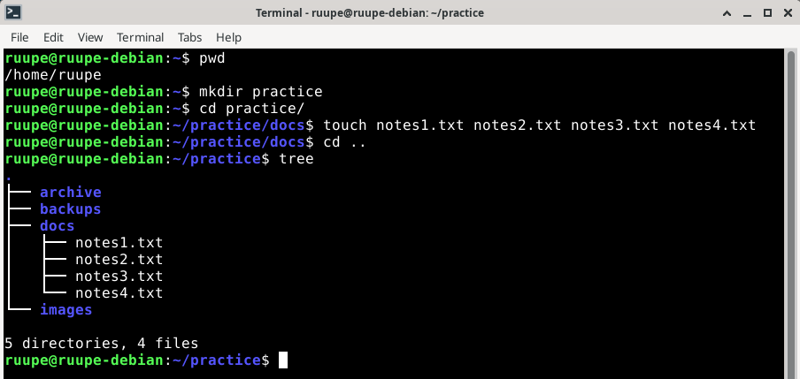

After we have the structure we used `nano` to add text to the two files.

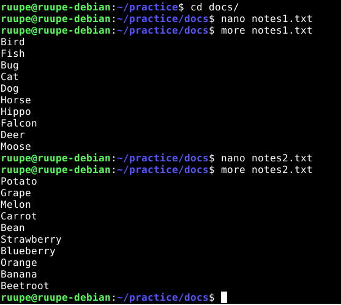

Next we use `mv` to rename, `cp` to copy and `rm` to delete. `nano` and `more` were used to edit and check the content of animals.txt

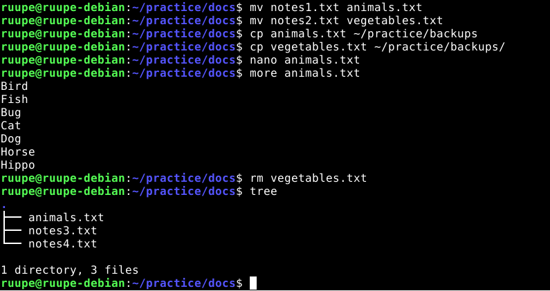

## 2 Grep and Pipe

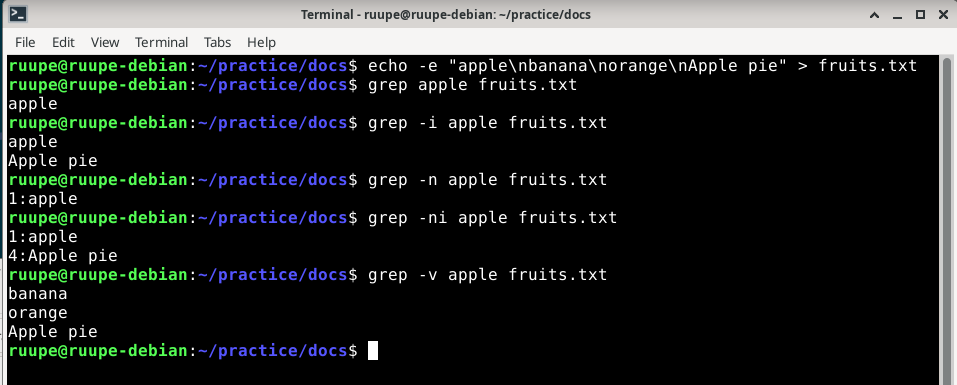

`grep` is used to search patterns in text. `-i` ignores case. `-n` shows line numbers. `-v` inverts the match (everything else BUT the search).

Next we used `wc` for word count. `-l` = lines. `-w` = words. `-c` = characters

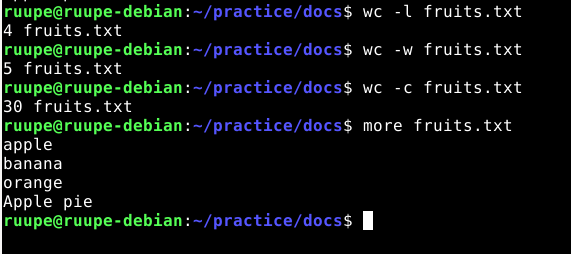

In the next phase we first edited the animals.txt file and then ran `cat` to print files contents paired with `|` so we could add more commands for what was selected with the `cat` command.

`grep cat` searched for lines with "cat". `wc -l` calculated the lines in the file. `sort | uniq` first sorts the lines to alphabetical order and `uniq` removes any dublicates.

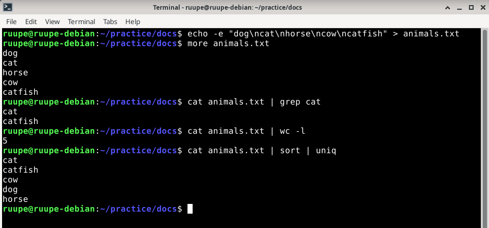

Next we're practicing grep, pipe and wc commands with GPL-2 license file.

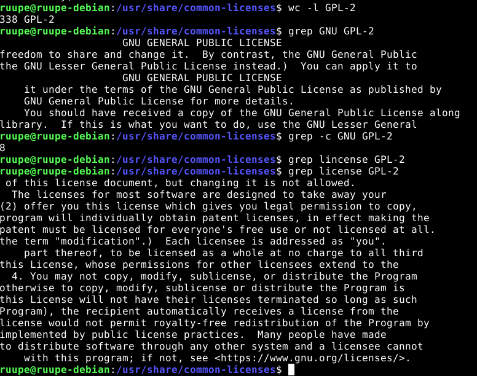
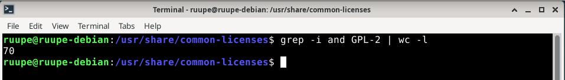

`wc -l GPL-2` => word count & counts lines  
`grep GNU GPL-2` => prints all lines that contain "GNU"  
`grep -c GNU GPL-2` => counts all the lines that contain "GNU"  
`grep license GPL-2` => shows all lines containing "license"  
`grep -i license GPL-2` => shows all lines containing "license" (case INsensitive)  
`grep -i and GPL-2 | wc -l` => finds lines with "and" (case insensitive) and counts them

### GPL-2 License - Main Ideas

- Freedom to use: anyone can run the software for any purpose
- Freedom to study: source code must be available so anyone can see how it works
- Freedom to modify: you can change the software however you need
- Freedom to distribute: you can share the original or modified software freely
- Copyleft: modified versions must also use GPL-2, keeping the software open source forever
- No warranty: software is provided "as is", the author is not responsible for any problems
- Protects users: nobody can take the software, make it closed source and sell it as their own

## 3 btop

In this step we first install btop with `sudo apt-get install`

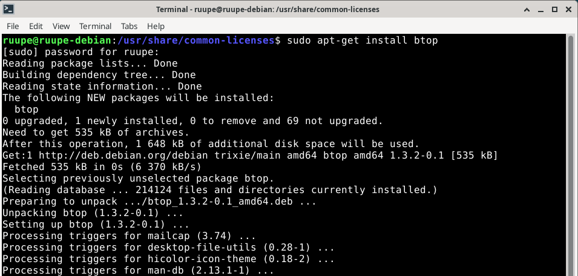

Then run the program with `btop`

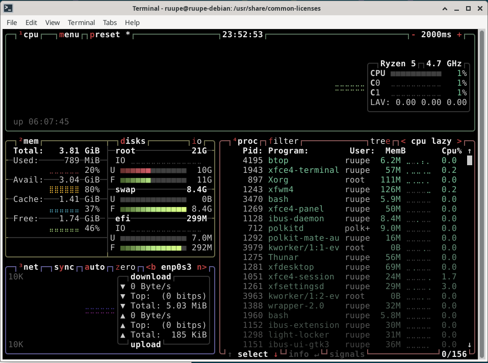

- The binaries are installed in /usr/bin/btop
- There seems to be no global configs on this program
- But there are user sperific configs in ~/.config

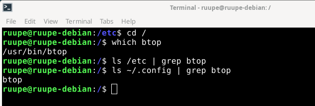

We use `dpkg -L btop` to see what files were installed with the btop package. This command does not seem to show where the config files were installed, which is a shame.

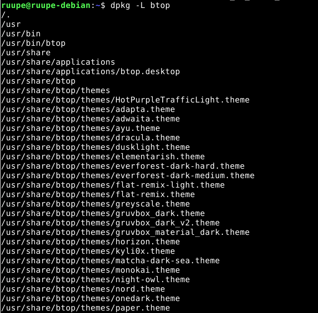

But cause we know that the config is in ~/.config/btop we can go there and make a backup with `cp`

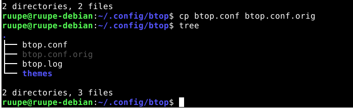

I used nano to edit the config file. Here's what the program now looks like:

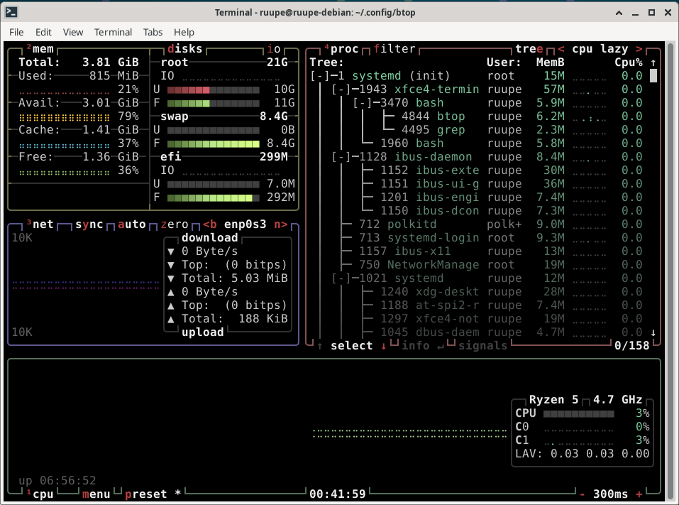

After changing proc_tree = Truuuuue the program seems to just change it back to default "False" state.

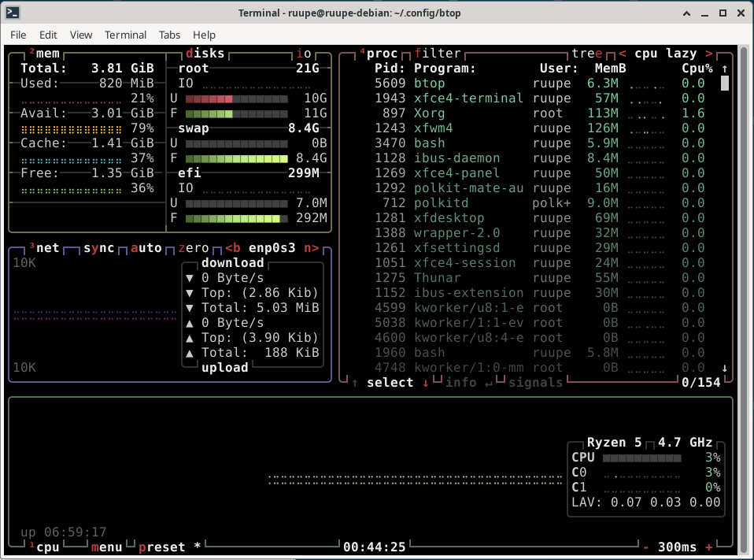
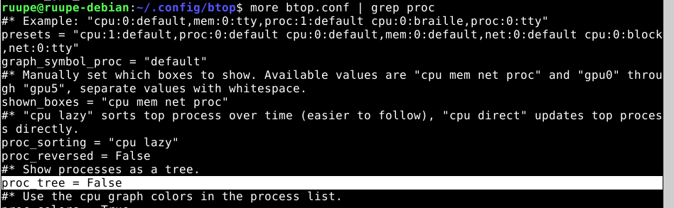

`ping -i 0.1 8.8.8.8`

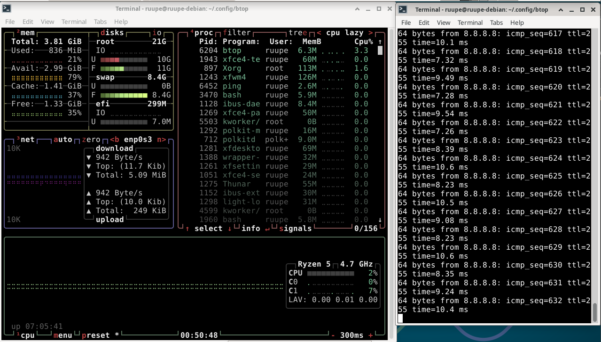

`yes > /dev/null`

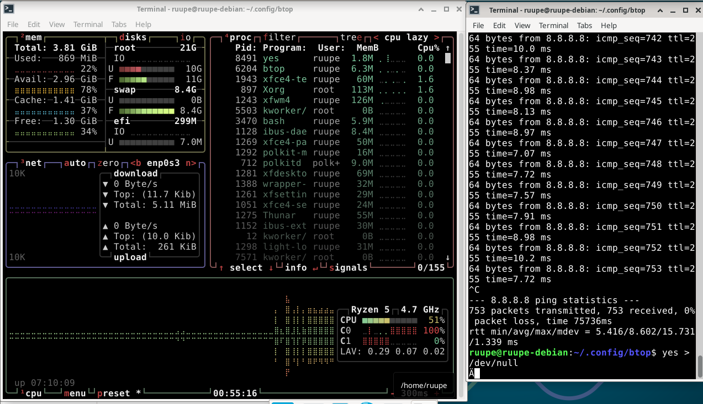

btop displays the virtual computers resources and their usage. We can see:

- CPU: overall usage and per core breakdown
- RAM: how much memory is in use and what is available
- Disk: storage usage and read/write speeds
- Processes: what programs are running and how much resources each one uses
- Network: upload and download speeds

## 4 Install Your Own Command-Line Application

In this task I installed to applications.

1. `sudo apt-get install cowsay`
2. `sudo apt-get install lolcat`

used together with `cowsay "hello" | lolcat`

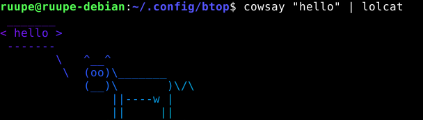
