# Module 3 - Apache2

I already had Apache2 installed with `sudo apt-get install apache2`. We can check the status with `sudo systemctl status apache2`

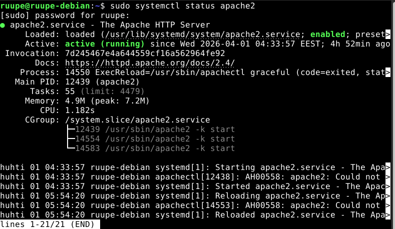

At this point I already had custom page configured:

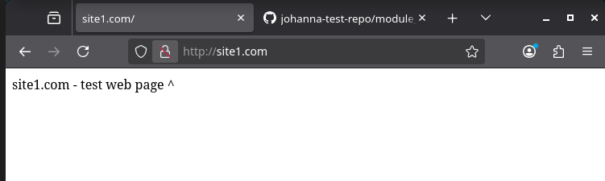
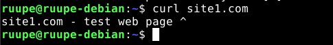

`echo 'This is my new…' | sudo tee /var/www/html/index.html`
`echo` 'String here' prints the string to stdout (standard output)
`|` takes the stdout and feeds it as stdin (standard input) to `sudo tee`
`sudo` gives root permissions, then `tee` writes to the string to the file but also to stdout, the latter not really making a difference in this case it seems.

Other ways to modify the file would be to use `nano` and do it manually. Other ways you could do this are:
`sudo sh -c "echo 'This is my new…' > /var/www/html/index.html"`
`echo 'This is my new…' | sudo dd of=/var/www/html/index.html`

The reason why `sudo echo 'This is…' > /var/www/html/index.html` does not work is that `>` makes the Shell try to run `/var/www/html/index.html` before `sudo echo 'This is…'` and because the file was not opened with sudo permissions the task fails.

I first made a backup of "hosts" with `cp hosts hosts.orig` in /ect/ and used `nano` to edit the file.
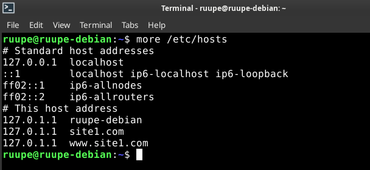

ufw was already istalled and configured to allow SSH (22/tcp) and HTTP (80/tcp)
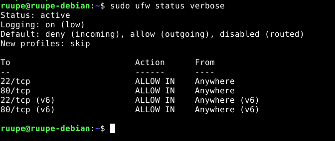

I denied 80/tcp from ufw but it does not seem to affect connecticity. The only thing I noticed is that 127.0.0.1 returns the default apache2 index.html and site1.com returns the custom page as configured. What I undestand is that ufw rules only apply to external requests.

All this time of writing this repost I have had this name-based virtual host config.
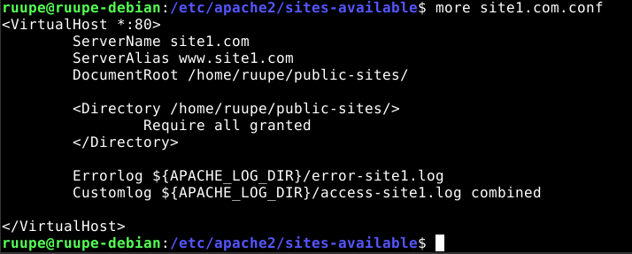

Check the systemd journal for Apache
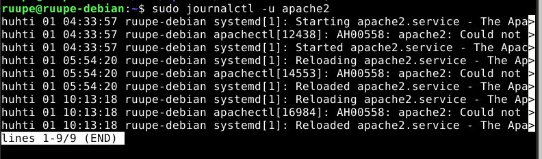

Checking the log files directly
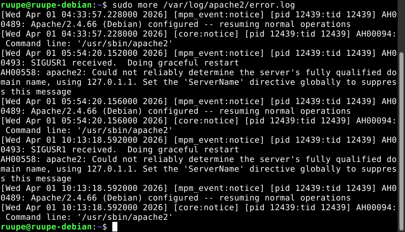

Made two types to virtual host "ServerNam" and "ServerAlia"
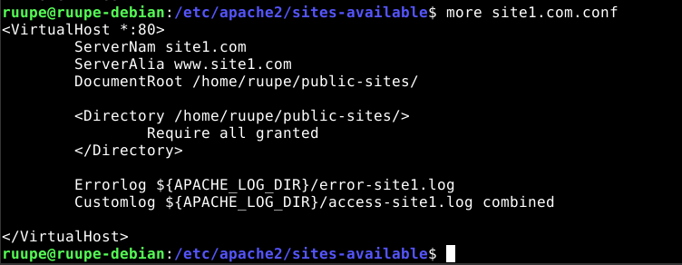

Logging systemd journal. Logs about domain name not being determined. Syntax error, also is able to tell that ServerNam might be misspelled.
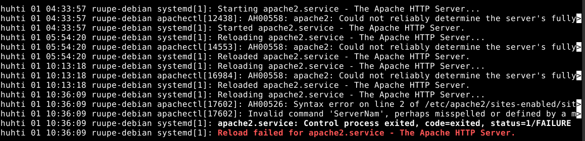
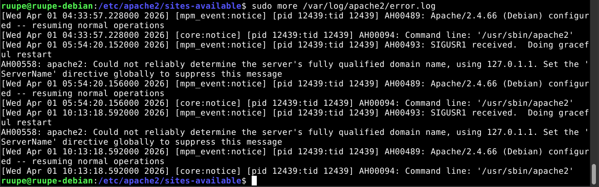

After fixing the ServerNam typo I still get errors. Same thing here, it seems to know exactly what's wrong. Simple typos on directives seem to be well handeled.
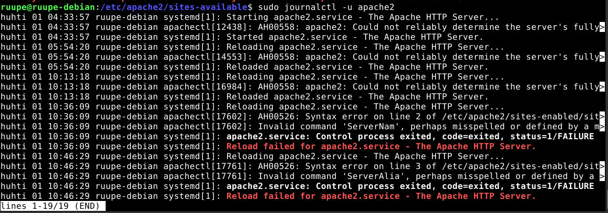
